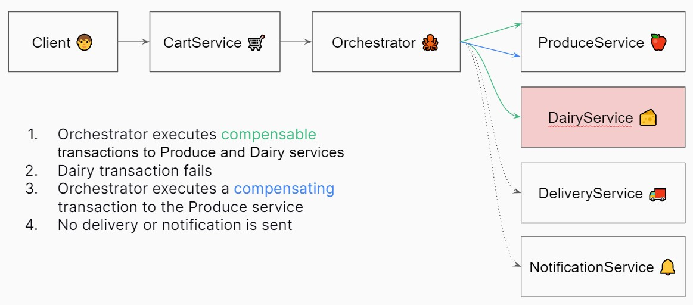

# Saga

Saga orchestration implementation for managing distributed transactions.

In the case of a failure, the service will behave as follows:


The project uses Docker Compose to manage running the different services. The commands for use are:

```shell
# From the root directory
docker compose build
docker compose up
```
